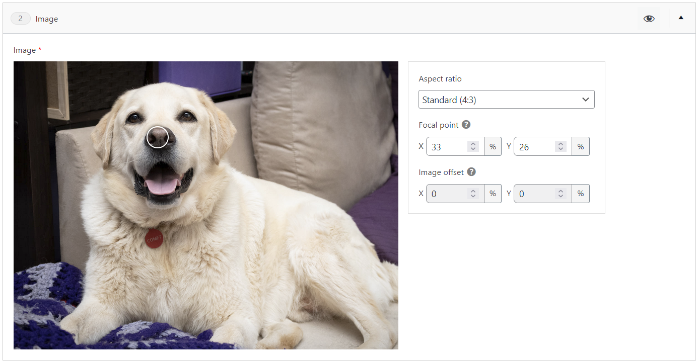

# Advanced Image Field for ACF

A [Advanced Custom Fields](https://www.advancedcustomfields.com/) field type providing in-editor options and real-time preview of aspect ratio and focal point selection.

Uses the built-in image, group, number, and select fields to create a more advanced image field while leveraging ACF's native editor UI and back-end processing functionality. It also utilises WordPress/ClassicPress's built-in attachment meta for alt text, caption, and title values to keep data consistent across the site, avoid duplicate/redundant data being stored in the database and potentially causing confusion for editors.



## Status

This is an alpha release that has been minimally tested for use as a standalone field and within a flexible content field, from which I have no reason to think it wouldn't also work with repeaters but have not tested this. More extensive and automated testing will be carried out as I continue work on this.

_This plugin is not affiliated with or endorsed by WPEngine, the owners of ACF._

## Installation

Zip package still to come. In the meantime, you can fork/clone/download this repo and place the `acf-advanced-image-field` folder in your WordPress `wp-content/plugins` directory and activate it as normal.

## Usage

The field returns an associative array value for use in your templates, with the following fields:

| Key            | Type                    | Description                                                                   |
|----------------|-------------------------|-------------------------------------------------------------------------------|
| `image_id`     | `int`                   | The attachment ID                                                             |
| `url`          | `string`                | The URL of the image, scaled to 1200px max on its longest side                |
| `aspect_ratio` | `AspectRatio`           | The selected aspect ratio                                                     |
| `focal_point`  | `array{x: int, y: int}` | The selected focal point coordinates                                          |
| `offset`       | `array{x: int, y: int}` | The percentage offsets required to position the image to suit the focal point |
| `alt`          | `string`                | The alt text set on the attachment                                            |
| `caption`      | `string`                | The caption set on the attachment                                             |
| `title`        | `string`                | The title of the attachment                                                   |

The `AspectRatio` type is an enum that matches keywords to common aspect ratios to ensure only valid values are used.
```php
enum AspectRatio: string {
	case STANDARD = '4:3';
	case PORTRAIT = '3:4';
	case SQUARE = '1:1';
	case WIDE = '16:9';
	case TALL = '9:16';
	case CLASSIC = '3:2';
	case CLASSIC_PORTRAIT = '2:3';
}
```

The plugin registers an image size in WordPress, called `image_advanced_resized` (and a constant for it,
`ACF_ADVANCED_IMAGE_FIELD_SIZE`), which scales larger images down to 1200px on their longest side. This is so that the image can be positioned within the frame according to its settings without additional images being generated every time the settings are changed, without potentially loading huge images on the front-end where it is not necessary. This resized image is the one returned by default when fetching the field value.

This plugin does not provide the HTML or CSS required to make the images format correctly on the front-end. You will need to do this in your theme.

**Example front-end code to come.**

## Back-end customisation

Developers can add and modify the options available using the `acf_advanced_image_options_fields` filter. By default, it contains the aspect ratio, focal point, and image offset field definitions.

For example, you could add a field like so:

```php
add_filter('acf_advanced_image_options_fields', function($fields, $parent_key) {
	array_push($fields, array(
		'key' => $parent_key . '_custom_option',
		'label' => 'Custom Option',
		'name' => 'custom_option',
		'type' => 'text',
		'instructions' => 'A custom option added via the acf_advanced_image_options_fields filter.',
	));
	
	return $fields;
})
```

You also have access to the existing field definitions, so you can:
- modify things like their labels, instructions, options, and default values,
- remove fields you don't want.

> [!WARNING]
> It is strongly recommended not to change any of the built-in field keys, names, types, or return values as this may break things or have other unintended consequences.
> If you use the filter to remove a field or change a field key or name (despite the above warning), please be aware that this _will not_ remove existing data for the removed/renamed field from the database,
